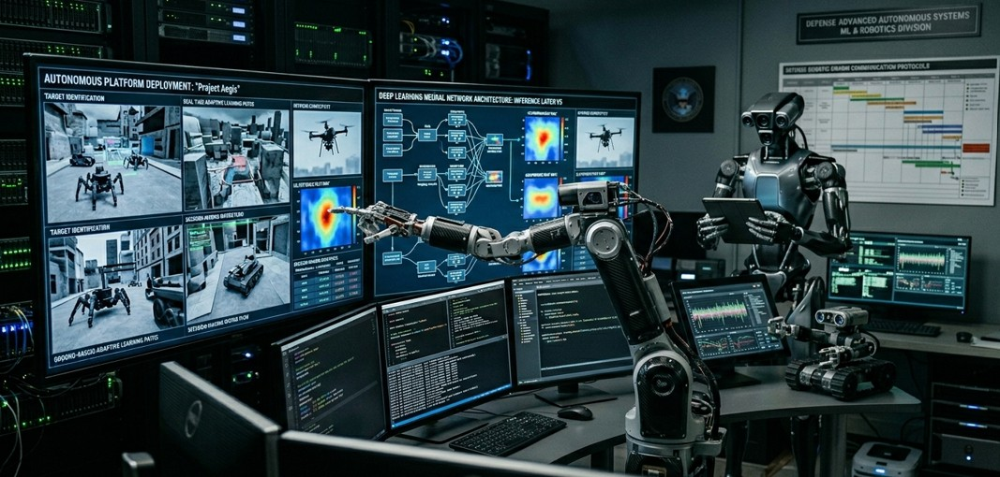

# Pooja Kiran

**ML / MLOps engineer focused on GPU training reliability, telemetry-driven ML, and secure deployment.**

- 📍 Phoenix / Tempe, Arizona, US  
- 🎓 M.S. Information Technology (Security), Arizona State University  
- 📄 Co-author, IEEE INDICON 2023  
- ☁️ AWS Certified  
- 🔗 [LinkedIn](https://www.linkedin.com/in/poojakiran/) · 📫 [Email](mailto:poojakiranbharadwaj@gmail.com)

---

## TL;DR

- I work on **GPU-heavy ML training** with a focus on avoiding OOMs, understanding allocator behavior, and keeping runs stable.  
- I build **telemetry and anomaly pipelines** (NASA C‑MAPSS, CubeSat-style data) with deployment and monitoring in mind.  
- I bring a **security-first mindset** from IT security into ML infra: isolation, secrets, and blast radius thinking.

---

## What I actually shipped

These are the systems I’ve been actively building and hardening. Repos contain code, configs, and work-in-progress benchmarks.

### Predictive-GPU-Memory-Defragmenter

**Repo:** [Predictive-GPU-Memory-Defragmenter](https://github.com/poojakira/Predictive-GPU-Memory-Defragmenter)

Goal: understand and reduce GPU training-time OOMs on RTX-class GPUs.

- Models fragmentation patterns and allocator behavior in realistic training workloads.  
- Includes GPU memory profiling, logging, and experiments around throughput vs. safety trade-offs.  
- Being updated with: baseline vs optimized runs, per-model metrics, and profiler screenshots.

Planned evidence in README:

- Hardware matrix (GPU, RAM), model sizes, and batch configs.  
- OOM rate and throughput comparison table vs. a vanilla training loop.  
- Reproducible script (`run_benchmark.py`) + CSV logs.

---

### PulseNet

**Repo:** [PulseNet](https://github.com/poojakira/PulseNet)

Goal: predictive maintenance and anomaly detection on **NASA C‑MAPSS** engine telemetry.

- Structured as a deployable pipeline: data prep, feature engineering, training, serving, and monitoring.  
- Dockerized local setup to mirror production-style environments.  
- First internal PR adds: unified feature registry, shadow deployment flow, and better config hygiene.[page:1]

Planned evidence in README:

- RUL / anomaly detection metrics, by engine variant.  
- Diagram of training → serving → monitoring path.  
- Example Grafana-style dashboard screenshots once exposed.

---

### CommandX

**Repo:** [CommandX](https://github.com/poojakira/CommandX)

Goal: mission-control-style telemetry simulation and anomaly surfacing for orbital / operator-facing systems.

- Simulates telemetry streams with EKF-based state estimation and anomaly flagging.  
- Provides operator views for system state and alerts.  
- Focused on making state, thresholds, and alert logic explicit and testable.

Planned evidence in README:

- Architecture diagram for sim → processing → UI.  
- Example “incident” walkthrough: input telemetry → alert → operator response.  
- Load profile / latency snapshots for the pipeline.

---

### orbit-Q

**Repo:** [orbit-Q](https://github.com/poojakira/orbit-Q)

Goal: CubeSat health monitoring pipeline with anomaly detection and retraining hooks.

- Ingests satellite-like telemetry into a Firebase-backed flow.  
- Uses ensemble modeling and scheduled retraining triggers for degrading components.  
- Treats retraining as a first-class pipeline step rather than an afterthought.

Planned evidence in README:

- Schema of telemetry and labels.  
- Examples of “before vs after” alerts when retraining is triggered.  
- End-to-end run instructions (from data push → UI / alert).

---

### Apex-Aegis-Tactical-Suite

**Repo:** [Apex-Aegis-Tactical-Suite](https://github.com/poojakira/Apex-Aegis-Tactical-Suite)

Goal: fast tactical simulation with ML surrogates.

- RK4-based trajectory simulator with an ML surrogate for faster decision support.  
- Explores runtime vs error trade-offs for “good-enough” real-time decisions.

Planned evidence in README:

- Error vs latency table for surrogate vs full simulation.  
- Plots comparing trajectories and decision latency.

---

## Benchmarking & reproducibility (WIP standard)

I’m standardizing how I present performance claims across repos so results are easy to read and reproduce.

Each flagship repo is being updated to include a section with:

- **Hardware**: GPU/CPU, RAM, OS, driver, and key library versions.  
- **Workload / dataset**: model size, telemetry source, scenario.  
- **Baseline**: clear comparison point (e.g., default training loop, non-optimized pipeline).  
- **Methodology**: number of runs, metrics, and aggregation.  
- **Artifacts**: scripts, logs, and CSVs.  
- **Limitations**: what has *not* been tested yet (e.g., only RTX-class, not yet A100/H100 or multi-node).

Example format:

```text
Hardware: RTX 4090, 64 GB RAM, CUDA 12.3, PyTorch 2.x
Workload: Transformer-based training on synthetic sequence dataset
Baseline: vanilla training loop without fragmentation-aware scheduling
Method: 20 runs, tracking OOMs, epoch time, and GPU utilization
Results: see results/fragmentation_benchmarks.csv and plots in reports/
Limitations: single-GPU, single-node; not yet validated on A100/H100
```

---

## Stack

### Languages

- Python  
- C++  
- SQL  

### ML

- PyTorch, TensorFlow, scikit-learn  

### MLOps / Cloud / DevOps

- AWS  
- Docker, Kubernetes  
- GitHub Actions, CI/CD  

### Systems / Observability

- Linux  
- GPU memory profiling and CUDA-driven experimentation  
- Telemetry pipelines, dashboards, and metrics  
- Performance benchmarking

### Security

- Secrets, isolation, and blast-radius thinking for ML infra  
- NIST / ISO-style controls as mental models  
- Applied crypto concepts (e.g., AES‑256) and secure data handling

---

## Open-source & collaboration

Right now I’m intentionally growing the *collaborative* side of my work:

- Using a branch → PR → review → merge workflow even on personal repos.  
- Opening small PRs to external ML / infra projects (docs, examples, small fixes).  
- Tightening issues, READMEs, and benchmarks in my repos so others can run them.  
- Keeping contribution activity **steady over time**, not as one-off spikes.[page:1]

---

## Publication

- **“A Personalized E‑Learning System Using Reinforcement Learning Through Satellite” – IEEE INDICON 2023**  
  [View on IEEE Xplore](https://ieeexplore.ieee.org/document/10440852)

Technical focus: Q-learning-based adaptive content delivery over high-latency satellite links, with dynamic state modeling under constrained network conditions.

---

## What I’m looking for

I’m targeting roles like:

- ML Platform / Infra Engineer  
- MLOps Engineer  
- Machine Learning Engineer  
- Cloud / Infrastructure Engineer for ML systems  

I’m especially interested in teams working on:

- GPU-heavy training systems and distributed training.  
- ML platforms and infrastructure for real deployments.  
- Observability and reliability for ML systems.  
- Secure deployment pipelines and multi-tenant ML.  
- Aerospace, defense, or other high-stakes ML applications.

---

## Current focus

Right now I’m mostly working on:

- GPU training reliability and fragmentation-aware workflows.  
- Telemetry-aware ML systems with better observability.  
- Hardening MLOps pipelines for realistic environments.  
- Upgrading documentation, benchmarking, and reproducibility.  
- Expanding open-source contributions in the ML / infra space.

---

## Connect

- [LinkedIn](https://www.linkedin.com/in/poojakiran/)  
- [GitHub](https://github.com/poojakira)  
- [Email](mailto:poojakiranbharadwaj@gmail.com)
