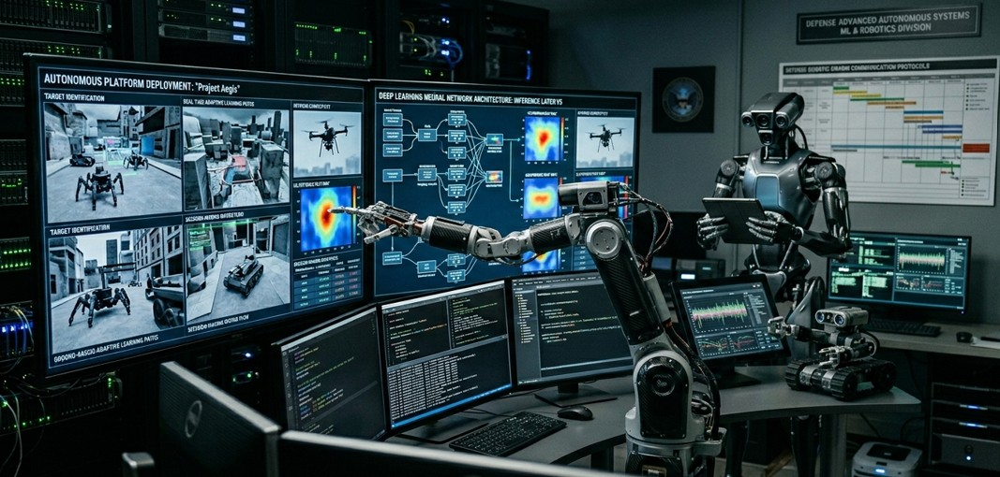

  

<h1 align="center">Pooja Kiran</h1>

  <strong>ML Security Engineer · IEEE INDICON 2023 Author · AWS Cloud Security</strong> 
  M.S. Information Technology (Security), Arizona State University

  
  

📍 Phoenix, Arizona · Open to work (July 2026)

---

## About

I build secure ML systems at the intersection of **machine learning** and **security** — anomaly detection, telemetry pipelines, predictive maintenance, and GPU infrastructure. My work spans satellite operations, industrial IoT, and carbon analytics.

---

## Tech Stack

  
  
  
  
  
  
  
  
  
  
  
  
  
  

---

## Featured Projects

| Project | Description |
|---------|-------------|
| [**Curriculum-Intelligence**](https://github.com/poojakira/Curriculum-Intelligence) | GNN-based knowledge tracing on EdNet-KT1 (131M interactions). GATv2 + GRU model for adaptive curriculum recommendations. Research extension of IEEE INDICON 2023 paper. |
| [**Secure-ML-platform**](https://github.com/poojakira/Secure-ML-platform) | Security-hardened ML platform for predictive maintenance on NASA C-MAPSS turbofan data. JWT auth, AES encryption at rest, hash-chain audit ledger, Prometheus observability, full CI/CD pipeline. |
| [**PulseNet-RUL-Forecasting**](https://github.com/poojakira/PulseNet-RUL-Forecasting) | Remaining Useful Life forecasting for industrial equipment using deep learning on sensor telemetry data. |
| [**RTX-OOM-Guard**](https://github.com/poojakira/RTX-OOM-Guard) | GPU memory defragmentation system for transformer training. Transformer-based fragmentation predictor with tiered compaction policy. Prevents OOM crashes with minimal overhead. |
| [**CubeSat-Health-Monitor**](https://github.com/poojakira/CubeSat-Health-Monitor) | CubeSat health monitoring with three-model ensemble (Isolation Forest + Autoencoder + LSTM), Kafka/Firebase ingestion, adaptive polling, and Streamlit ops dashboard. |
| [**Mission-Control-Telemetry-Simulator**](https://github.com/poojakira/Mission-Control-Telemetry-Simulator) | Satellite telemetry simulation with J2-perturbed Extended Kalman Filter, genetic algorithm orbit optimization, and operator-facing Streamlit dashboard. |
| [**Aerospace-Trajectory-Simulator**](https://github.com/poojakira/Aerospace-Trajectory-Simulator) | Vectorized projectile-motion rollout with RK4 integration and analytical surrogate model. Numerically equivalent to floating-point round-off. |
| [**ESG-Carbon-Telemetry**](https://github.com/poojakira/ESG-Carbon-Telemetry) | Carbon emissions tracking with async batch ingestion, Merkle hash-chain audit trail, PostgreSQL persistence, and ARIMA forecasting. |
| [**Orbital-IoT-Monitor**](https://github.com/poojakira/Orbital-IoT-Monitor) | ESP32 + MQTT + Python telemetry pipeline with autoencoder anomaly detection, Kalman filtering, and containerized Streamlit dashboard. |

---

## Background

- **M.S. Information Technology (Security)** — Arizona State University (2024–2026)
- **B.E. Computer Science & Engineering** — M.S. Ramaiah University of Applied Sciences
- **IEEE INDICON 2023** — Author & Presenter (Personalized E-Learning with Reinforcement Learning)
- **Honeywell Aerospace × ASU** — Technology Innovation Lab
- **AWS** — Cloud Security Foundations, Cloud Architecting

---

## Domains

`Predictive Maintenance` · `Satellite Telemetry` · `GPU Memory Management` · `Anomaly Detection` · `Carbon Analytics` · `IoT Security` · `Knowledge Tracing`

---

  

