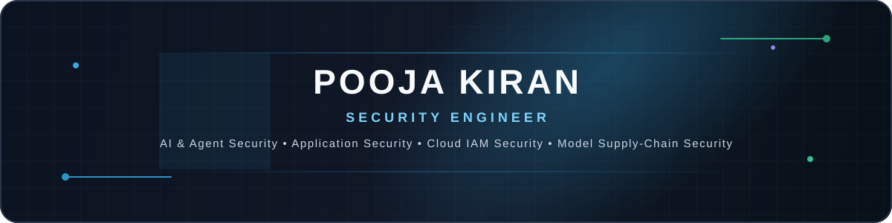

  

  <a href="https://poojakira.github.io/Pooja_Kiran_Portfolio_Website/">Portfolio</a>
  ·
  <a href="https://poojakira.github.io/Pooja_Kiran_Portfolio_Website/Pooja_Kiran_Agentic_AI_Security_Engineer_Resume.pdf">Resume</a>
  ·
  <a href="https://www.linkedin.com/in/poojakiran/">LinkedIn</a>
  ·
  <a href="mailto:poojakiranbhardwaj@gmail.com">Email</a>

<table>
<tr>
<td width="68%" valign="top">

## About

I am a **Security Engineer focused on AI and agent security, application security, cloud IAM, and model supply-chain security**.

I build controls at the boundaries where agents call tools, identities gain authority, and model artifacts enter trusted workflows. My work emphasizes **default-deny design, reproducible testing, security telemetry, and evidence that can be reviewed**.

I completed an **M.S. in Information Technology (Security) at Arizona State University**, GPA **3.87/4.00**.

</td>
<td width="32%" align="center" valign="middle">
  
</td>
</tr>
</table>

## Selected security systems

<table>
<tr>
<td width="33%" valign="top">

### [MCP Agent Security Gateway](https://github.com/poojakira/mcp-agent-security-gateway)

Default-deny MCP/JSON-RPC gateway for agent-to-tool execution.

**723 passing tests**  
**81.91% coverage**  
**55 prompt-injection patterns**

Python · FastAPI · Elastic Security

</td>
<td width="33%" valign="top">

### [AWS Agent Identity Guard](https://github.com/poojakira/aws-agent-identity-guard)

Static analysis for AI-agent and workload IAM policies.

**25 deterministic rules**  
**240 passing tests**  
SARIF 2.1.0 · Code Scanning

Python · AWS IAM · GitHub Actions

</td>
<td width="33%" valign="top">

### [HF Model Provenance Scanner](https://github.com/poojakira/hf-model-provenance-scanner)

Non-executing inspection of model repositories and artifacts.

**241 passing tests**  
**75.67% coverage**  
**33/33 adversarial fixtures**

Python · SafeTensors · GGUF · ONNX

</td>
</tr>
</table>

## More work

- [LLM Red Team Framework](https://github.com/poojakira/llm-redteam-framework): adversarial evaluation for LLM security
- [Dataset Poisoning Detector](https://github.com/poojakira/dataset-poisoning-detector): statistical and streaming checks for training-data integrity
- [Adversarial ML Lab](https://github.com/poojakira/adversarial-ml-lab): FGSM, PGD, C&W, robustness evaluation, and MITRE ATLAS mapping

## Experience

- **Independent AI Security Researcher & Engineer** · Self-directed research · Aug. 2024 to Present
- **Business & Compliance Lead, AEROSEC** · Honeywell Aerospace Technologies × ASU · Aug. 2025 to Dec. 2025
- **Graduate Teaching Assistant / IT Grader** · Arizona State University · Jan. 2025 to Oct. 2025

## Core toolkit

**AI & Agent Security:** MCP/JSON-RPC 2.0, tool-call security, prompt injection, RAG security, LLM red teaming, model provenance, adversarial ML

**Identity & Product Security:** AWS IAM, least privilege, trust policies, permission boundaries, capability-based authorization, API security, threat modeling

**Security Engineering:** Python, Rust, C++, FastAPI, pytest, Hypothesis, SARIF, CodeQL, Docker, Kubernetes, GitHub Actions

**Detection & Observability:** Elastic Security, ECS, SIEM, Prometheus, tamper-evident audit logging, MITRE ATLAS, OWASP LLM Top 10

## Research

[A Personalized E-Learning System Using Reinforcement Learning Through Satellite](https://ieeexplore.ieee.org/document/10440852) · IEEE INDICON 2023

## Connect

**Portfolio:** https://poojakira.github.io/Pooja_Kiran_Portfolio_Website/  
**LinkedIn:** https://www.linkedin.com/in/poojakiran/  
**Email:** poojakiranbhardwaj@gmail.com

Project metrics above are tied to repository-level test and validation evidence. Scope and limitations are documented in the individual repositories.
